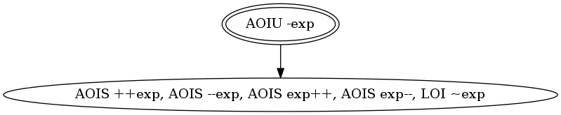

# Target: ``exp``

## Snippet


```java
private int field1;

public int method1(int exp) {
    field1 = exp;
    return exp + field1;
}
```


### DMSG



## Sufficient Mutants


|Total of Mutants¹    | Sufficient Mutants |Reduction |
|                ---: |               ---: |     ---: |  
| 6                   | 1                  |83.34%    |

¹Excluding stillborn and stubborn mutants.

## Mutants


| Operator | #Mutants | Stillborn | Stubborn | Total  |
| :---     |     ---: |      ---: |     ---: |   ---: |
| LOI      | 1        | 0         | 0        | **1**  |
| VDL/CDL  | 1        | -1        | 0        | **0**  |
| AOIU     | 1        | 0         | 0        | **1**  |
| AOIU     | 4        | 0         | 0        | **4**  |
|**Total** | **7**    | **-1**    | **0**    | **6**  |
