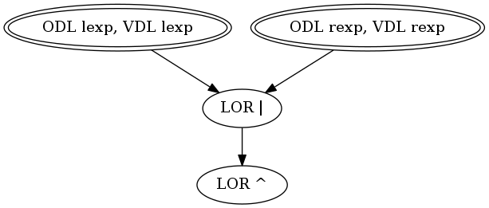

# Target: ``lexp & rexp``

## Snippet


```java
public int and(int lexp, int rexp) {
    return lexp & rexp;
}
```


### DMSG



## Sufficient Mutants


|Total of Mutants¹    | Sufficient Mutants |Reduction |
|                ---: |               ---: |     ---: |  
| 6                   | 2                  |66.67%    |

¹Excluding stillborn and stubborn mutants.

## Mutants


| Operator | #Mutants | Stillborn | Stubborn | Total  |
| :---     |     ---: |      ---: |     ---: |   ---: |
| ODL      | 2        | 0         | 0        | **2**  |
| VDL/CDL  | 2        | 0         | 0        | **2**  |
| LOR      | 2        | 0         | 0        | **2**  |
|**Total** | **6**    | **0**     | **0**    | **6**  |
