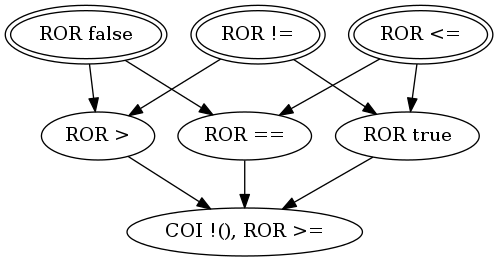

# Target: ``lexp < rexp``

## Snippet


```java
public boolean lt(int lexp, int rexp) {
    return lexp < rexp;
}
```


### DMSG



## Sufficient Mutants


|Total of Mutants¹    | Sufficient Mutants |Reduction |
|                ---: |               ---: |     ---: |  
| 8                   | 3                  |62.50%    |

¹Excluding stillborn and stubborn mutants.

## Mutants


| Operator | #Mutants | Stillborn | Stubborn | Total  |
| :---     |     ---: |      ---: |     ---: |   ---: |
| ROR      | 7        | 0         | 0        | **7**  |
| COI      | 1        | 0         | 0        | **1**  |
|**Total** | **8**    | **0**     | **0**    | **8**  |

