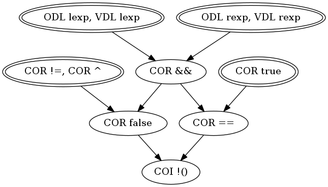

# Target: ``lexp || rexp``

## Snippet


```java
public boolean or(boolean lexp, boolean rexp) {
    return lexp || rexp;
}
```


### DMSG



## Sufficient Mutants


|Total of Mutants¹    | Sufficient Mutants |Reduction |
|                ---: |               ---: |     ---: |  
| 11                  | 4                  |63.63%    |

¹Excluding stillborn and stubborn mutants.

## Mutants


| Operator | #Mutants | Stillborn | Stubborn | Total  |
| :---     |     ---: |      ---: |     ---: |   ---: |
| ODL      | 2        | 0         | 0        | **2**  |
| VDL/CDL  | 2        | 0         | 0        | **2**  |
| COR      | 6        | 0         | 0        | **6**  |
| COI      | 1        | 0         | 0        | **1**  |
|**Total** | **11**   | **0**     | **0**    | **11** |
