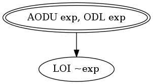

## Target: ``-exp``

## Snippet


```java
public int minus(int exp) {
    return -exp;
}
```


### DMSG



## Sufficient Mutants


|Total of Mutants¹    | Sufficient Mutants |Reduction |
|                ---: |               ---: |     ---: |  
| 3                   | 1                  |66.67%    |

¹Excluding stillborn and stubborn mutants.

## Mutants


| Operator | #Mutants | Stillborn | Stubborn | Total  |
| :---     |     ---: |      ---: |     ---: |   ---: |
| LOI      | 1        | 0         | 0        | **1**  |
| ODL      | 1        | 0         | 0        | **1**  |
| VDL/CDL  | 1        | -1        | 0        | **0**  |
| AODU     | 1        | 0         | 0        | **1**  |
|**Total** | **4**    | **-1**    | **0**    | **3**  |
