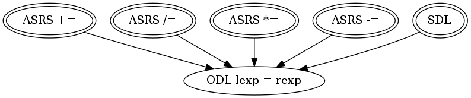

## Target: ``lhs %= rhs`

## Snippet


```java
public int mod(int lexp, int rexp) {
    lexp %= rexp;
    return lexp;
}
```


### DMSG



## Sufficient Mutants


|Total of Mutants¹    | Sufficient Mutants |Reduction |
|                ---: |               ---: |     ---: |  
| 6                   | 5                  |16.67%    |

¹Excluding stillborn and stubborn mutants.

## Mutants


| Operator | #Mutants | Stillborn | Stubborn | Total  |
| :---     |     ---: |      ---: |     ---: |   ---: |
| ASRS     | 4        | 0         | 0        | **4**  |
| ODL      | 1        | 0         | 0        | **1**  |
| SDL      | 1        | 0         | 0        | **1**  |
|**Total** | **6**    | **0**     | **0**    | **6**  |
